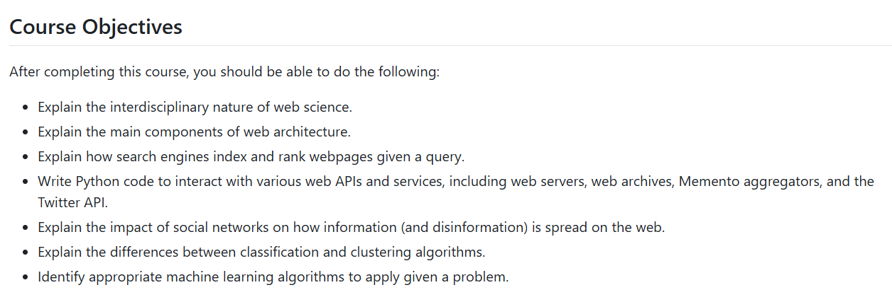

# HW# - EC 0.6 - Reports
### Matthew Haydon
### CS 432, Spring 2026
### 2/6/2026

# Q1

*You may copy the question into your report, but make sure that you make it clear where the question ends and your answer begins.*

## Answer

The figure below shows the Course Objectives for the CS 432 Course.



*If you want to include code in your report, you can insert a screenshot (if it's legible), or you can copy/paste the code into a fenced code block.*

```python
#!/usr/local/bin/python3
# testargs.py

import sys

a = "Hello, World!"
b = a.split(",")
print(b)
```

The table below shows the first four weeks of the CS 432 Class Schedule.  

|Week|Week Start Date|Topic|
|:---|:---|:---|
|1|Jan 20|Introduction to Web Science and Web Architecture|
|2|Jan 30|Introduction to Python|
|3|Feb 6|Measuring the Web|
|4|Feb 13|Searching the Web|

The table below shows an example confusion matrix (you'll see this term later) from <https://en.wikipedia.org/wiki/Confusion_matrix>.

| | |Actual||
|---|---|---|---|
|**Predicted**| |Cat|Dog|
| |Cat|5 (TP)|3 (FP)|
| |Dog|2 (FN)|3 (TN)|

*You must provide some discussion of every answer. Discuss how you arrived at the answer and the tools you used. Discuss the implications of your answer.*

# Q2

## Answer

# Q3

## Answer

# References

*Every report must list the references that you consulted while completing the assignment. If you consulted a webpage, you must include the URL.  These are just a couple examples.*

* W3Schools, Python Examples <[https://stackoverflow.com/questions/7771011/how-can-i-parse-read-and-use-json-in-python](https://www.w3schools.com/python/python_examples.asp)>
* Communications of the ACM, Web Science: An Interdisciplinary Approach to Understanding the Web, <[https://chat.openai.com/share/5de76e93-c26b-4665-a0fc-b782b01a9285](https://cacm.acm.org/research/web-science/)>
* ODU Systems Group, GlobalProtect VPN for Windows, <https://systems.cs.odu.edu/vpn/>
