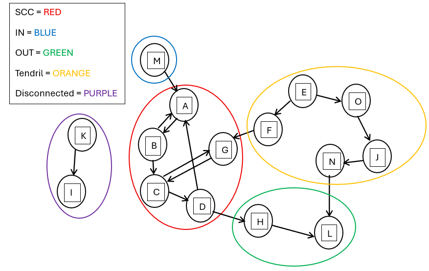
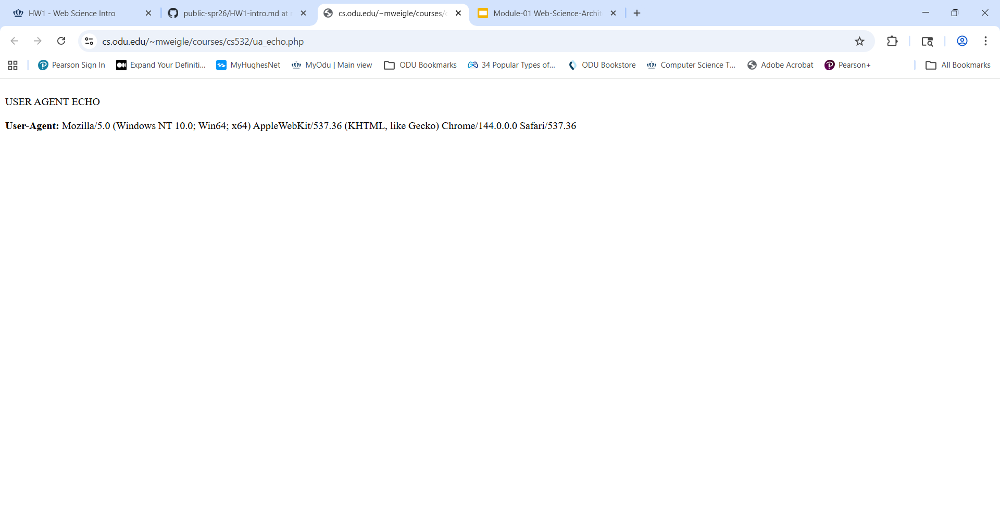
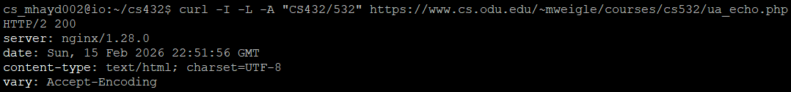
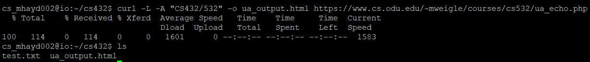
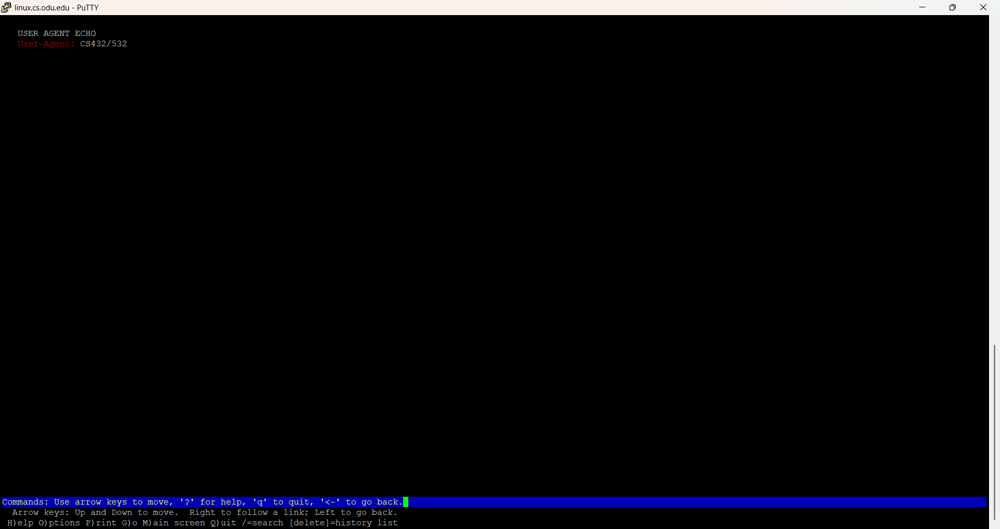

# HW# - EC 0.6 - Reports
### Matthew Haydon
### CS 432, Spring 2026
### 2/6/2026

# Q1

Consider the "bow-tie" structure of the web in the Broder et al. paper ["Graph Structure in the Web"](http://snap.stanford.edu/class/cs224w-readings/broder00bowtie.pdf) that was described in Module 1.

Now consider the following links:

```text
A --> B
B --> A
B --> C
C --> D
C --> G
D --> A
D --> H
E --> F
E --> O
F --> G
G --> C
H --> L
J --> N
K --> I
M --> A
N --> L
O --> J
```

Draw the resulting [directed graph](https://en.wikipedia.org/wiki/Directed_graph) (either sketch on paper or use another tool) showing how the nodes are connected to each other and include an image in your report.  This does not need to fit into the bow-tie type diagram, but should look more similar to the graph on slide 24 from [Module-01 Web-Science-Architecture](https://docs.google.com/presentation/d/178GkNtFAPB5fzs1D-wdCnlOdbcTyhpAIz_wKxVUaHVk/edit#slide=id.ga9773ac230_0_799).

For the graph, list the nodes (in alphabetical order) that are each of the following categories:
* SCC: 
* IN: 
* OUT: 
* Tendrils: 
    * indicate if the tendril is reachable from IN or can reach OUT
* Tubes: 
    * explain how the nodes serve as tubes
* Disconnected:

## Answer

To analyze the given set of hyperlinks, I first constructed a directed graph where each node represents a webpage and each directed edge represents a hyperlink from one page to another. Using this graph, I identified the components of the bow-tie structure as described in Graph Structure in the Web.



The Strongly Connected Component (SCC) of the graph consists of nodes A, B, C, D, and G. These nodes form the core of the graph because there exists a directed path between every pair of nodes within this set. For example, A and B link to each other directly, B links to C, C links to D and G, D links back to A, and G links back to C, ensuring full mutual reachability.

The IN component contains node M. Node M has a directed path to node A, which is part of the SCC, but there are no paths from the SCC back to M. Therefore, M can reach the SCC but cannot be reached from it, satisfying the definition of the IN component.

The OUT component consists of nodes H and L. These nodes are reachable from the SCC via the path D → H → L. However, there are no directed paths from either H or L back into the SCC, which places them in the OUT component.

The tendrils of the graph include nodes E, F, O, J, and N. These nodes are not part of the SCC, IN, or OUT components. Node E connects to the SCC through the path E → F → G and also connects toward the OUT component through the path E → O → J → N → L. However, these nodes are not reachable from the SCC itself, nor do they provide a direct path from IN to OUT, which classifies them as tendrils. These tendrils are reachable from side paths connected to the SCC and can reach the OUT component without being part of the SCC.

There are no tube nodes in this graph. A tube would require a path that connects the IN component directly to the OUT component without passing through the SCC. In this case, no such path exists.

Finally, the disconnected component consists of nodes K and I. These nodes form an isolated subgraph with the directed edge K → I and have no paths to or from the SCC, IN, or OUT components.


# Q2

Demonstrate that you know how to use `curl` and are familiar with the available options.  Complete the following steps using https://www.cs.odu.edu/~mweigle/courses/cs532/ua_echo.php as the URI to request. Explain the results you get from each step.

a) First, load the webpage at the URI in your web browser.  The result should show the "User-Agent" HTTP request header that your web browser sends to the web server. Take a screenshot to include in your report.

b) Use a single `curl` command with the appropriate options to do the following:
  * request the URI
  * show the HTTP response headers
  * follow any redirects
  * change the User-Agent HTTP request field to "CS432/532"

Take a screenshot of the `curl` command and options you used and the result of your execution to include in your report.

c) Use a single `curl` command with the appropriate options to do the following:
  * request the URI
  * follow any redirects
  * change the User-Agent HTTP request field to "CS432/532"
  * save the HTML output to a file

Take a screenshot of the `curl` command and options you used and the result of your execution to include in your report.  

d) View the HTML output file that was produced by `curl` from part c in a web browser and take a screenshot to include in your report.

## Answer

a) Viewing the User-Agent in a Web Browser

First, I loaded the webpage at
https://www.cs.odu.edu/~mweigle/courses/cs532/ua_echo.php
using a standard web browser. The page displays the value of the User-Agent HTTP request header sent by the browser to the server. The User-Agent identifies the browser and operating system being used (for example, Chrome on Windows). This confirms that browsers automatically include a User-Agent header with HTTP requests.



b) Using curl to request headers, follow redirects, and set User-Agent

Next, I used a single curl command with multiple options to request the URI, display HTTP response headers, follow redirects, and modify the User-Agent header.



Explanation of options:
 * -I requests only the HTTP response headers
 * -L tells curl to follow any redirects
 * -A "CS432/532" sets the User-Agent request header to CS432/532

The output shows the HTTP response headers returned by the server, and the page reflects the modified User-Agent value. This demonstrates that curl allows full control over HTTP request headers and redirect behavior.

c) Saving the HTML output to a file

I then used curl to request the same URI, follow redirects, change the User-Agent, and save the HTML response body to a file.



Explanation of options:
 * -L follows redirects
 * -A "CS432/532" sets the User-Agent header
 * -o ua_output.html saves the response body to a file named ua_output.html

This command stores the HTML content returned by the server locally instead of displaying it in the terminal.

d) Viewing the saved HTML file in a browser

Finally, I opened the saved ua_output.html file in a web browser. The page displays the User-Agent value as CS432/532, confirming that the HTML file saved by curl contains the same content that would be received by a browser making the same request.



# Q3

For some of our later assignments, you will be analyzing large numbers of webpages. The goal of this question is to write a Python program to gather URIs of webpages that have enough text so they will be useful later.

Your program must do the following:
* take the URI of a seed webpage as a command-line argument
* extract all the links from the page's HTML
* for each link, request the URI and use the `Content-Type` HTTP response header to determine if the link references an HTML file (`text/html`)
    * if it does, use the `Content-Length` HTTP response header to determine if it contains more than 1000 bytes
       * if it does, then print the final URI (after any redirects) 

Use this program to collect at least 500 **unique** URIs of webpages that contain more than 1000 bytes.  Save the list of URIs to a file to use in later assignments.  The file must be uploaded to your GitHub repo.

Be aware of the need for a timeout.  If you use the Python requests library, make sure to include the [timeout](https://docs.python-requests.org/en/master/user/quickstart/#timeouts) parameter to your call to `get()`.  
* Example: `requests.get(url, timeout=5)   # 5 second timeout`

There are a couple ways you can use your program to gather the URIs:
* run the program multiple times with different seed webpages until you get to 500
* have your program randomly pick a URI that you've collected and use that as the new seed until you've collected 500 unique URIs

Here is a snippet of the expected operation:

```
% python3 collect-webpages.py https://weiglemc.github.io/
https://weiglemc.github.io/
https://weiglemc.github.io/publications/
https://weiglemc.github.io/teaching/
https://weiglemc.github.io/students/
https://weiglemc.github.io/talks/
https://weiglemc.github.io/schedule/
https://weiglemc.github.io/cv/
https://weiglemc.github.io/contact/
https://www.odu.edu/
https://www.odu.edu/facultydevelopment/women-in-stem#tab9=3&done1612907281342
https://www.odu.edu/computer-science/academics/graduate/masters
https://www.odu.edu/computer-science/academics/graduate/phd
https://oduwsdl.github.io/
https://weiglemc.github.io/publications/recent
https://minerva.defense.gov/Research/Funded-Projects/Article/2957187/innovating-interdisciplinary-methods-for-hard-to-reach-environments/
https://oducsreu.github.io
https://www.odu.edu/computer-science
https://www.clemson.edu/cecas/departments/computing/
https://cs.unc.edu/
https://www.unc.edu/
http://jekyllrb.com/
https://mademistakes.com/work/jekyll-themes/minimal-mistakes/
```

**Another Example**
```
% python3 collect-webpages.py https://weiglemc.github.io/ 200
Need to collect 178 more URIs...
 random seed: https://cs.unc.edu/
Need to collect 125 more URIs...
 random seed: https://cs.unc.edu/event/resume-workshop/
Need to collect 121 more URIs...
 random seed: https://give.unc.edu/donate?p=COMP
Need to collect 114 more URIs...
 random seed: https://cs.unc.edu/undergraduate/lecture-archive/
Need to collect 110 more URIs...
 random seed: https://weiglemc.github.io/talks/
Need to collect 89 more URIs...
 random seed: https://www.matchinggifts.com/unc/
Need to collect 77 more URIs...
 random seed: https://cs.unc.edu/undergraduate/ug-advising/
Need to collect 71 more URIs...
 random seed: https://cs.unc.edu/research/facilities/
Need to collect 69 more URIs...
 random seed: https://cs.unc.edu/person/john-majikes/
Need to collect 68 more URIs...
 random seed: https://weiglemc.github.io/students/
Need to collect 54 more URIs...
 random seed: https://weiglemc.github.io/talks/2020-11-09-course
Need to collect 54 more URIs...
 random seed: https://sigir.org/sigir2019/
Need to collect 41 more URIs...
 random seed: https://cs.unc.edu/undergraduate/courses-for-non-majors/
Need to collect 41 more URIs...
 random seed: https://www.loc.gov/programs/web-archiving/about-this-program/
Need to collect 30 more URIs...
 random seed: https://sciences.sorbonne-universite.fr/

Collected 200 unique URIs
https://weiglemc.github.io/
https://weiglemc.github.io/publications/
https://weiglemc.github.io/teaching/
https://weiglemc.github.io/students/
https://weiglemc.github.io/talks/
https://weiglemc.github.io/schedule/
https://weiglemc.github.io/cv/
https://weiglemc.github.io/contact/
...
```

In your report, describe which method you used to collect the 500 URIs and provide a list of the seed webpages that you used.

You will likely want to use the BeautifulSoup Python library for this question. On the ODU-CS Linux machines, you may need to run `pip3 install beautifulsoup4` before you can use BeautifulSoup, but you don't need root privileges to do this.

## Answer

For this task, I implemented a Python program that collects URIs of webpages containing sufficient textual content for later analysis. The program accepts a seed URI as a command-line argument and downloads the corresponding HTML page using the requests library with a five-second timeout to avoid hanging requests. Links are extracted from the HTML using the BeautifulSoup library.

Each extracted link is requested, and the HTTP response headers are examined to determine whether the resource is an HTML document by checking that the Content-Type header contains text/html. The program also verifies that the Content-Length header indicates a size greater than 1000 bytes. Only pages that satisfy both conditions are retained. Redirects are followed automatically, and the final resolved URI is stored.

To ensure uniqueness, collected URIs are stored in a set. When additional pages are needed, the program randomly selects a previously collected URI as a new seed and continues crawling until at least 500 unique URIs have been collected. The final list of URIs is written to a file and uploaded to a GitHub repository for use in later assignments.

The list of 500 URIs are in the uris.txt file.

# References

* CS 432 Module 01 Google Slides, Web Science: Web Science and Web Architecture, <https://docs.google.com/presentation/d/178GkNtFAPB5fzs1D-wdCnlOdbcTyhpAIz_wKxVUaHVk/edit?slide=id.g86fe3756a5_0_0#slide=id.g86fe3756a5_0_0>
* GeeksForGeeks, curl Command in Linux for Examples, <https://www.geeksforgeeks.org/linux-unix/curl-command-in-linux-with-examples/>
* W3Schools, Python Tutorial, <https://www.w3schools.com/python/default.asp>
